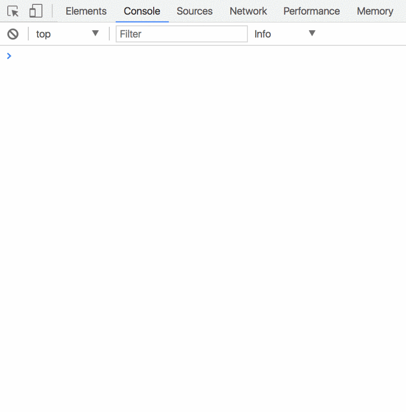

# Objects in JavaScript

Everything in JavaScript is an object. Well, except the 6 primitive types of string, symbol, integer, float, boolean, null, and undefined.

Everything **else** is an object.

Arrays? They're objects.

Functions? Yep, those two.

Classes? Sure, just fancy object definitions.

Want to see what JavaScript defines as an [Object](https://developer.mozilla.org/en-US/docs/Web/JavaScript/Reference/Global_Objects/Object)? Open Chrome, open the Developer Tools, go to the Console tab, type in `{}` and see what gets displayed. These functions will be available to any custom object that you define in your system that is linked to the base Object.

# Videos to Watch

1. [Object Keys](https://www.youtube.com/watch?v=cEVnlKgySsg)
1. [Javascript - How to Access Javascript Object Property Names Using A `for in` LOOP](https://www.youtube.com/watch?v=fDBuAnu0fvo)
1. [Modular Javascript - Prototypal Pattern vs Classical OOP in JS
](https://www.youtube.com/watch?v=doXpW5AD60Q)
1. [Object.create - Object Creation in JavaScript P6 - FunFunFunction #57](https://www.youtube.com/watch?v=CDFN1VatiJA)
1. 
1. 
1. 
1. 
1. 
1. 
1. [Object creation patterns](https://www.youtube.com/watch?v=xizFJHKHdHw)

# 
