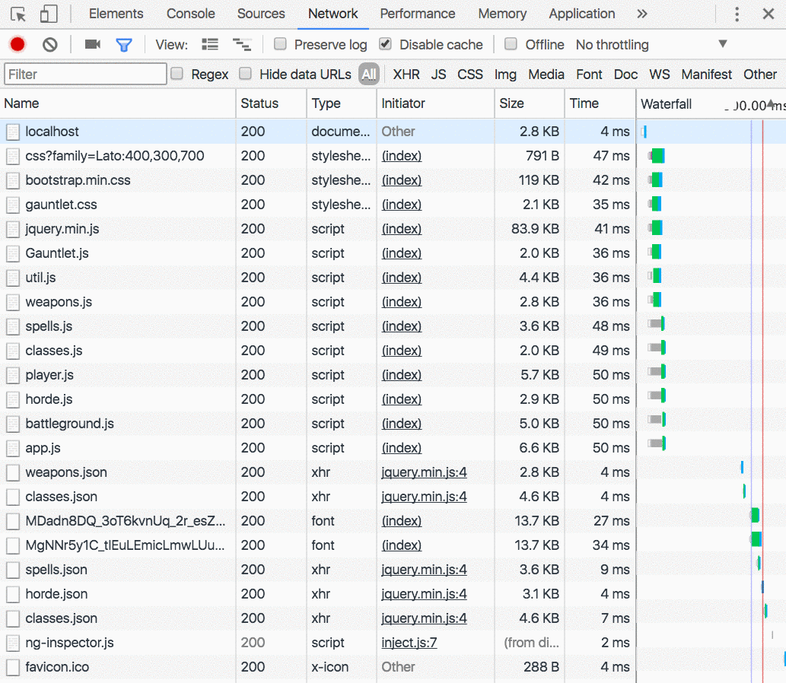
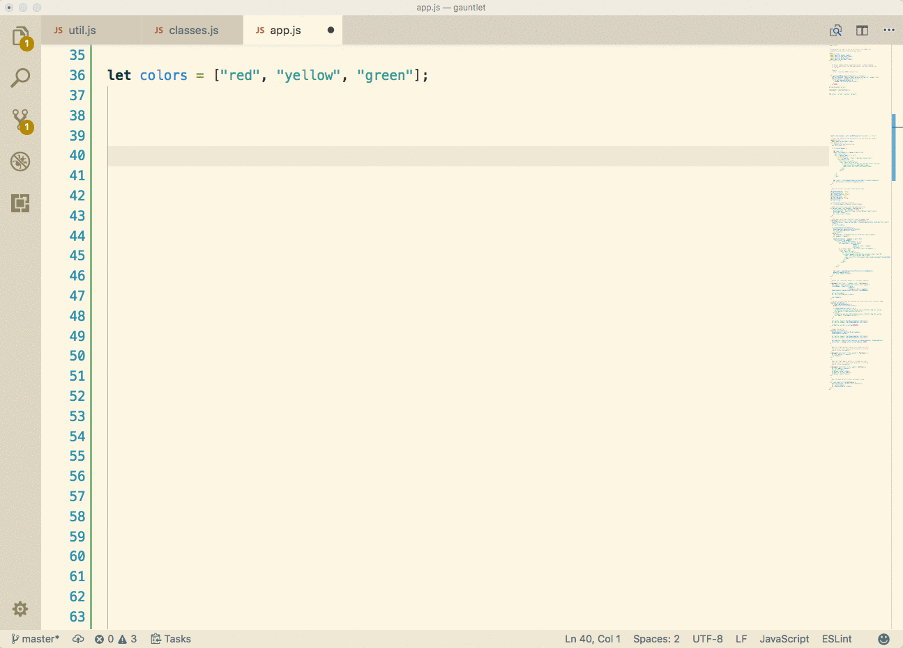
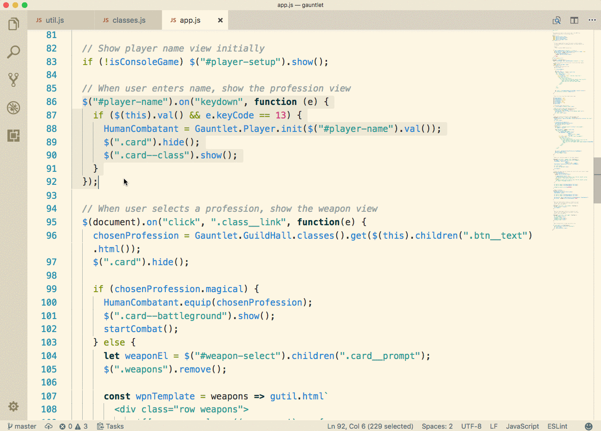

# Debugging

There are three main methods for exploring code your code in the browser.

1. `console.log`
1. `debugger;`
1. Breakpoints

## How to read an error

In any development language you use, when a error occurs in your code, you will always be provided with what's called a [stack trace](https://en.wikipedia.org/wiki/Stack_trace) that will tell you what line of code was currently being evaluated, and in which file that code is located. You will be expected to read the stack trace whenever an error occurs, and investigate the exact line of code for obvious syntax errors before asking for help from staff.

Looks at the example image below. You'll see that the error shows the name of the file, and the line of code on which it occurred. I then click on the file and it highlights the code right there in the browser.


## Using the network tab

The network tab in the developer tools lets you see all of the files that a website uses to present HTML, style it with CSS, and add interactivity with JavaScript.


You can then click on each file and look at all of the metadata for it. If the requested file was data, in JSON format, you can click the the Preview section to explore the data.



## Examining Your Code

### console.log

The `console.log()` method in JavaScript allows you to display any information you want in the Console tab of the browser. You can display simple messages.

```js
for (let i = 0; i < 6; i++) {
  console.log("I am inside the loop now")
}
```

Or you can display the current value of a variable to test that your logic is working correctly. In the example below, I have an array of three string values. I use `console.log()` to display the entire contents of the array. I then add two, new elements to the end of the array. I want to make sure that it worked, so I `console.log()` the length of the array to ensure that those two items got added.



### debugger

Using the `debugger;` keyword somewhere in your code will force the browser to halt execution so that you can review your code right in the browser and see what the values of variable are at that moment. In the example below, I put in a `debugger` statement so that I can see what is contained inside the colors array, and then I can step one line of code at a time and see how it changes.


### Using Breakpoints

In this example, I have a block of code that responds to user input, so it doesn't actually execute as soon as the page loads. I put a breakpoint on the line of code that I want to examine, and when the user performs the appropriate action, my JavaScript halts execution and I can examine the code.


